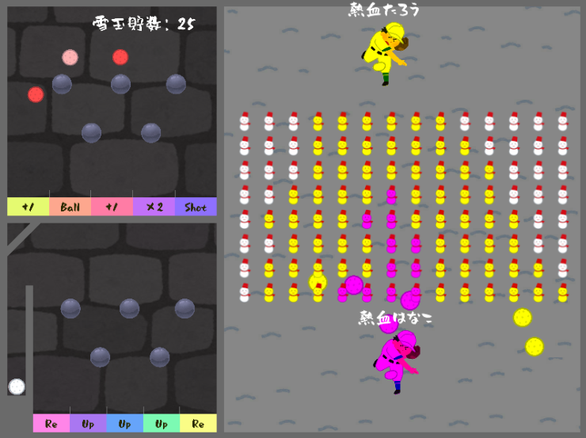
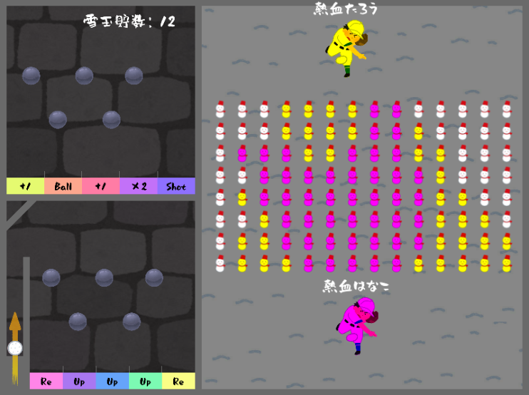

# PinballSbiw(熱血!!ぴんぼーる雪合戦)

## URL

https://unityroom.com/games/pinballsnow

## ゲーム概要

雪玉を投げ合って対戦する楽しいマルチゲーム。

ピンボールエリアでは、ボールを弾いてスコアブロックに衝突すると、雪玉が生成されます。

生成された雪玉は、対戦に使用される特別な球です。

## 開発環境

★言語

　C#

★ゲームエンジン

　Unity

★外部ライブラリ

　Photon
 
　https://www.photonengine.com/ja-JP/#

## 設計書

[クラス図.xlsx](./クラス図.xlsx)

## 操作機能

マウスクリック

「Ｚ」キー：プレイヤーを左へ移動

「Ｘ」キー：プレイヤーを右へ移動

## ゲーム詳細

★メイン画面

　ゲームが起動すると、メイン画面が表示します。
 
　プレイヤー名をテキストボックスに入力して、ゲームスタートボタンをクリックすると、
 
　ゲーム画面に切り替わります。

★ゲーム画面

　ピンボールエリアでボールを弾いてスコアブロックに当てます。

　スコアブロックにはボールを増やしたり雪玉を貯玉したりできます。

　スコアブロックの"Shot"に触れると、雪玉が発射されて、敵プレイヤーを狙うことができます。 

　
　
